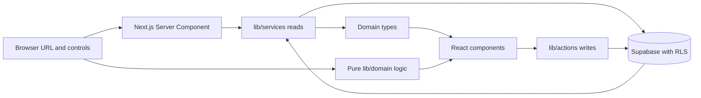

# Architecture and data flow

VroomView keeps the interface and the data source apart. Pages and components work with domain types; service functions translate database records into those types. The app currently uses Supabase. A second backend is a possible future adapter behind the same boundary, only when a real need justifies it.



## Reading the board

The home route (`app/page.tsx`) loads the viewer and `listConcepts()` concurrently. `lib/services/concepts.service.ts` selects the summary fields, joins author and count data, and maps database rows to `ConceptSummary`. Per-viewer vote state is added at this boundary. Board and related reads intentionally omit long-form `details` and `feasibility`; `getConcept()` loads the full `Concept` for the detail route.

`lib/domain/feed.ts` parses URL parameters and applies search, body-style/lens filtering, and sorting. It is pure TypeScript, so its rules can be exercised without rendering React or connecting to Supabase. The URL is the shareable state for board filters. `FeedView` owns the interactive controls and presents those results.

The board currently loads at most 1,000 concept summaries in one request. This keeps the current board simple, but it is a known scaling limit: before the community outgrows it, choose pagination and how URL filters, sorting, and counts behave across pages. Do not silently raise the cap or assume the whole-board approach scales indefinitely.

## Writing a proposal or review

Interactive forms call Server Actions in `lib/actions`. Actions verify the current user, validate and normalize input, and use a server Supabase client. The database remains the authority: Row Level Security and constraints enforce which writes are allowed. UI validation exists to explain mistakes in plain language; it is not an authorization boundary.

```text
Proposal form → createConcept action → validation → Supabase insert
                                                    ↓
                                      constraints + RLS enforce rules
```

Do not test this flow by writing to production. A write integration test needs an isolated local/test project, disposable identities, and explicit authorization for that test setup.

## Viewer identity and request caching

`getViewer()` in `lib/services/viewer.service.ts` verifies the session with Supabase and resolves the public profile. React `cache()` shares the result among server reads within a request, so concurrent page/service calls can reuse the same verified viewer. This request scope matters: viewer-specific fields such as `viewerVote` and `isOwn` must never be reused across different people or requests.

## Where code belongs

- `app/`: routes, layouts, and page composition.
- `components/`: presentation and user interaction, with small client boundaries.
- `lib/domain/`: pure rules that do not need React or a database.
- `lib/services/`: server-side reads and mapping from storage shape to domain shape.
- `lib/actions/`: validated server-side writes.
- `lib/supabase/`: runtime-specific client creation.
- `types/`: domain contracts and generated database types.

## Component and style ownership

`DraftingTable` coordinates draft state and submission. Its four sections in `components/concepts/proposal/` receive state and callbacks through props: idea fields, vehicle fields, specification editing, and preview. This lets a contributor change one section without duplicating draft state or introducing a global store.

The feed follows the same separation: `FeedView` handles controls, URL updates, and rendering; `lib/domain/feed.ts` handles the selection and ordering rules. Existing ranking math remains in `utils/rank.ts`. Database-to-domain checks for specifications, topics, and vote directions are shared in `lib/domain/concept-mapping.ts`.

`app/globals.css` imports five style sheets: `styles/themes.css` for palettes, `base.css` for document defaults and focus, `components.css` for shared controls, `community.css` for gallery composition, and `motion.css` for animations and reduced-motion behavior. Change a semantic token at its definition and run the contrast check rather than copying color values into a component.

## Extending the backend boundary

The service/action convention predates the gallery refresh; the refactor strengthens its contracts and mapping. Services still contain Supabase queries, and actions still use Next.js Server Actions. There is no formal adapter interface or implemented Python/Java backend.

If an external ranking or analysis service becomes useful, call it from an appropriate server-side service/action and map its response into the app's domain types. Keep transport details out of presentation components. The integration must still define authorization, response validation, timeouts and failure behavior, and integration tests. A write integration must also preserve the database's authorization and integrity rules. Until a concrete need appears, Supabase remains the persistence system.

## Local test boundaries

`npm run check` runs ESLint, TypeScript, the Node test suite, and theme contrast checks. Tests exercise pure domain rules and real action logic with framework/database dependencies replaced by test helpers; they do not contact a live database. `npm run format:check` verifies formatting, while `npm run build` verifies production compilation.

The board and comment services each cap reads at 1,000 rows. A future pagination design must address selection, ranking, counts, and ordering across pages. Local unit checks do not validate deployed RLS, authenticated end-to-end writes, or external-service behavior. No CI workflow or database integration-test environment was added by the refresh.

## Board presentation and interactions

The concept gallery uses three columns on desktop, two on tablet, and one on phones. A concept can propose a new vehicle or argue for a change or variant of an existing model, such as an all-wheel-drive Honda Odyssey. A concept with an authored drawing shows its “Ideator’s sketch”; one without a drawing uses a text-led preview. Keep the Ideator's identity and the community's votes and comments visible as part of the same social proposal.

The header has one cycling theme control for all four themes. A saved theme takes precedence; Vellum is the default when no preference has been saved. The header action is “Share a concept,” without a plus icon. Use concise functional labels such as Community, Comments, and Topics; explanations belong where they help people browse, post, or comment. Avoid sidebars, repeated calls to action, brand slogans, and decorative copy.

Topic selection, mobile navigation, and mobile preview use native modal dialogs. Authentication success moves focus to and announces the result; vote errors remain visible to the person voting. Clay's control contrast has been adjusted. Coordinate-based sketch input is available alongside pointer drawing; a local harness checked serialization, but that is not a cross-browser or screen-reader review.

## Verification status

On 2026-09-27, `npm run check` passed lint, TypeScript, 16 tests, and contrast checks across all four themes (18 color pairs per theme). `npm run format:check`, `git diff --check`, and `npm audit` also passed; the audit reported zero findings. Targeted browser checks passed for 320px and 390px overflow, cycling through all four themes and Graphite persistence after reload, topic-dialog keyboard/Escape focus return, combined search/body/tag filters, keyboard sorting, same-page menu close with scroll restored, guest posting/discussion login return, and labeled/autocomplete sign-in fields. An isolated local harness verified two sketch points serialize as one valid stroke; it did not publish a proposal. Removing a specification returns focus to its former label. The mobile concept preview was verified with an inert background, Escape/backdrop/close dismissal, restored trigger focus, and scroll restoration when resized to desktop.

The final production build passed on 2026-09-27 and completed all 13 routes. Authenticated live writes, cross-browser behavior, and manual screen-reader review remain untested. These checks do not certify full WCAG conformance or production security.

For contributor setup and a first walkthrough, see [CONTRIBUTING.md](../CONTRIBUTING.md). For the security model and schema details, see the matching VroomViewNotes pages.
