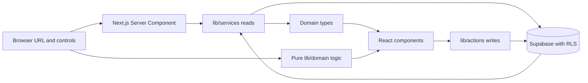

# Architecture and data flow

VroomView keeps the interface and the data source apart. Pages and components work with domain types; service functions translate database records into those types. The app currently uses Supabase. A second backend is a possible future adapter behind the same boundary, only when a real need justifies it.



## Reading the board

The home route (`app/page.tsx`) loads the viewer and `listConcepts()` concurrently. `lib/services/concepts.service.ts` selects the summary fields, joins author and count data, and maps database rows to `ConceptSummary`. Per-viewer vote state is added at this boundary. Board and related reads intentionally omit long-form `details` and `feasibility`; `getConcept()` loads the full `Concept` for the detail route.

`lib/domain/feed.ts` parses URL parameters and applies search, body-style/lens filtering, and sorting. It is pure TypeScript, so its rules can be exercised without rendering React or connecting to Supabase. The URL is the shareable state for board filters. `FeedView` owns the interactive controls and presents those results.

The board currently loads at most 1,000 concept summaries in one request. This keeps the current board simple, but it is a known scaling limit: before the community outgrows it, choose pagination and how URL filters, sorting, and counts behave across pages. Do not silently raise the cap or assume the whole-board approach scales indefinitely.

## Writing a proposal or review

Interactive forms call Server Actions in `lib/actions`. Actions verify the current user, validate and normalize input, and use a server Supabase client. The database remains the authority: Row Level Security and constraints enforce which writes are allowed. UI validation exists to explain mistakes in plain language; it is not an authorization boundary.

```text
Proposal form → createConcept action → validation → Supabase insert
                                                    ↓
                                      constraints + RLS enforce rules
```

Do not test this flow by writing to production. A write integration test needs an isolated local/test project, disposable identities, and explicit authorization for that test setup.

## Viewer identity and request caching

`getViewer()` in `lib/services/viewer.service.ts` verifies the session with Supabase and resolves the public profile. React `cache()` shares the result among server reads within a request, so concurrent page/service calls can reuse the same verified viewer. This request scope matters: viewer-specific fields such as `viewerVote` and `isOwn` must never be reused across different people or requests.

## Where code belongs

- `app/`: routes, layouts, and page composition.
- `components/`: presentation and user interaction, with small client boundaries.
- `lib/domain/`: pure rules that do not need React or a database.
- `lib/services/`: server-side reads and mapping from storage shape to domain shape.
- `lib/actions/`: validated server-side writes.
- `lib/supabase/`: runtime-specific client creation.
- `types/`: domain contracts and generated database types.

The app should remain understandable without a backend migration. If a future Python or Java service becomes useful, adapt it behind the service/action boundary and keep the UI speaking the same domain types. Until then, Supabase remains the only persistence system; avoid speculative adapters.

For contributor setup and a first walkthrough, see [CONTRIBUTING.md](../CONTRIBUTING.md). For the security model and schema details, see the matching VroomViewNotes pages.
